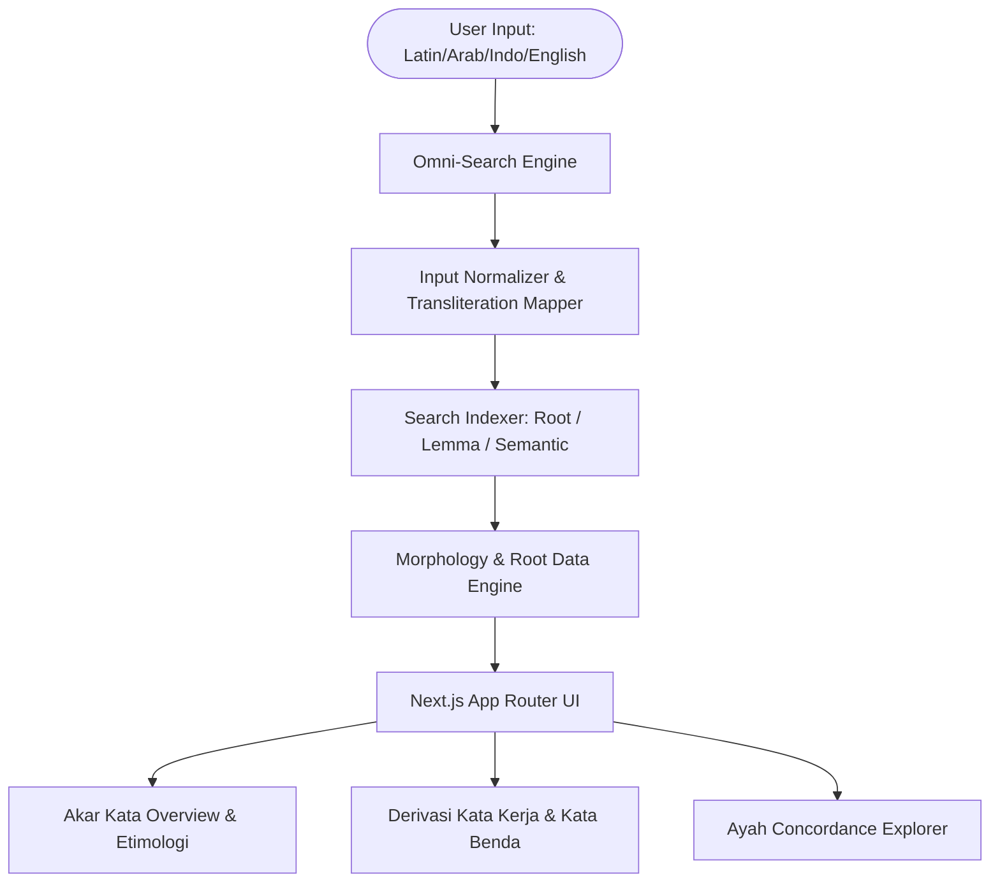

# Design Spec: Qurabic-Indo (Quranic Arabic Corpus & Morphology Bahasa Indonesia)

**Tanggal:** 2026-08-12  
**Status:** Draft Spec - Menunggu Review User  
**Stack:** Next.js (App Router), TypeScript, Tailwind CSS, Lucide Icons, Modern Islamic Glassmorphism UI  

---

## 1. Visi & Tujuan Produk

**Qurabic-Indo** adalah platform web modern berbasis **Bahasa Indonesia** untuk eksplorasi Morfologi Al-Qur'an dan Database Akar Kata (Root Word Corpus). Web ini menghadirkan kemudahan seperti web *Quranic Arabic Corpus* & aplikasi *Kalaam*, namun dirancang khusus dengan UI/UX kelas dunia, pencarian multi-bahasa yang instan, serta penjelasan tata bahasa (Nahwu/Sharaf) dan etimologi makna dalam Bahasa Indonesia.

### Fitur Utama V1:
1. **Omni-Search Multi-Bahasa:**
   - **Arab:** `ص-ب-ر` atau `صبر`
   - **Latin / Transliterasi:** `sabar`, `sabara`, `s-b-r`
   - **Bahasa Indonesia:** `sabar`, `kesabaran`, `menahan`, `batu`
   - **Bahasa Inggris:** `patience`, `patient`, `endure`
2. **Database & Katalog Akar Kata (Morphology Library):**
   - Menampilkan koleksi akar kata Al-Qur'an lengkap dengan frekuensi kemunculan.
   - Penjelasan definisi mendalam (Makna Umum + Makna Etimologi Klasik, misal: *صَبَر* bermakna menahan/mengikat, serta secara harfiah merujuk pada batu yang keras atau tanaman yang pahit).
3. **Pemisahan Derivasi Kata Kerja (Verbs) & Kata Benda (Nouns):**
   - **Kata Kerja (Fi'il):** Form I (`صَبَرَ`), Form III (`صَابَرَ`), Form VIII (`اِصْطَبَرَ`), Fi'il Mudhari' (`يَصْبِرُ`), Fi'il Amr (`اِصْبِرْ`).
   - **Kata Benda (Isim):** Masdar (`صَبْر`), Isim Fa'il (`صَابِر`), Isim Mubalaghah (`صَبُور`), Bentuk Jamak (`صُبَّار`).
4. **Eksplorer Ayat Al-Qur'an (Ayah Concordance):**
   - Menampilkan ayat-ayat yang memuat akar kata tersebut.
   - Text Al-Qur'an ber-harakat indah dengan *highlight* khusus pada kata turunan akar tersebut.
   - Terjemahan Bahasa Indonesia lengkap.

---

## 2. Arsitektur Sistem & Data Engine



### Data Schema (`lib/types/morphology.ts`):
```typescript
export interface RootWord {
  id: string; // e.g. "s-b-r"
  rootArabic: string; // e.g. "ص ب ر"
  rootLatin: string; // e.g. "s-b-r"
  titleIndo: string; // e.g. "Sabar / Menahan Diri"
  meaningsIndonesian: string[];
  etymologyNote?: string; // e.g. "Kata sobaro secara etimologi klasik bermakna batu keras atau tanaman pahit..."
  totalOccurrences: number;
  verbs: DerivativeWord[];
  nouns: DerivativeWord[];
  occurrences: VerseOccurrence[];
}

export interface DerivativeWord {
  id: string;
  arabic: string; // e.g. "صَبَرَ"
  transliteration: string; // e.g. "sabara"
  form?: string; // e.g. "Form I", "Form VIII"
  posTag: string; // e.g. "Fi'il Madhi", "Isim Fa'il"
  meaningIndo: string;
  frequency: number;
}

export interface VerseOccurrence {
  surahNumber: number;
  ayahNumber: number;
  surahNameIndo: string;
  verseArabic: string;
  verseIndo: string;
  highlightWordArabic: string;
  highlightWordIndo: string;
}
```

---

## 3. UI/UX Design System (Obsidian Emerald Glassmorphism)

- **Theme:** Dark Mode Deep Obsidian Slate (`#0B0F17` / `#111827`)
- **Primary Color:** Emerald Glow (`#10B981` / `#059669`)
- **Secondary Highlight:** Warm Gold Amber (`#F59E0B`)
- **Card Style:** Glassmorphism (`bg-slate-900/60 backdrop-blur-md border border-slate-800 hover:border-emerald-500/30 transition-all`)
- **Typography:**
  - Font Arab: **Amiri** / **Scheherazade New** (Google Fonts)
  - Font UI/Latin: **Plus Jakarta Sans** / **Inter**

### Navigasi & Halaman:
1. `/` (Beranda & Omni Search Engine + Trending Roots)
2. `/akar/[slug]` (Halaman Detail Akar Kata e.g. `/akar/s-b-r` atau `/akar/k-t-b`)
3. `/morfologi` (Katalog Index Akar Kata & Filter Kata Kerja / Kata Benda)

---

## 4. Verification & Testing Strategy
- Verification client-side & SSR rendering Next.js.
- Unit testing pada search normalizer (memastikan query `sabar`, `صبر`, `s-b-r`, `batu` menunjuk ke akar kata `ص-ب-ر`).
- Responsive design check pada breakpoint mobile (375px) dan desktop (1280px).
